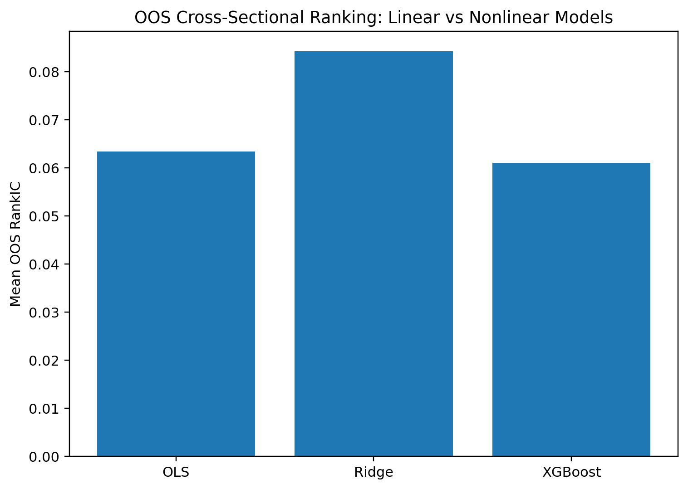
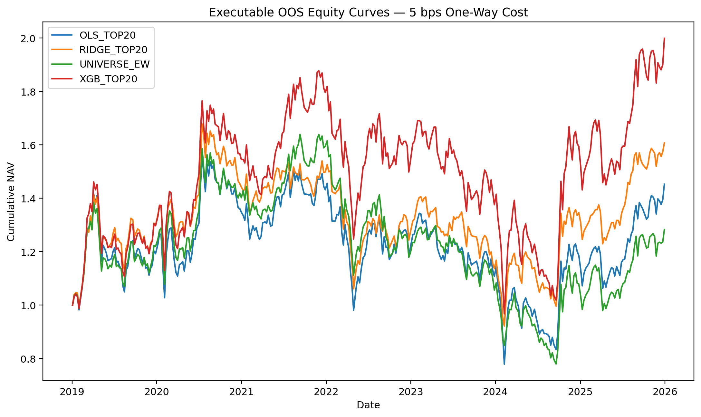
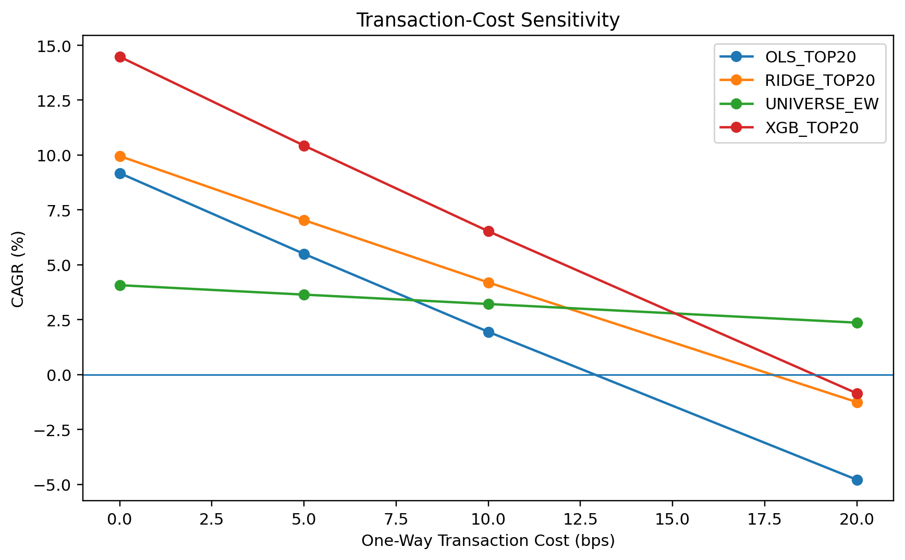
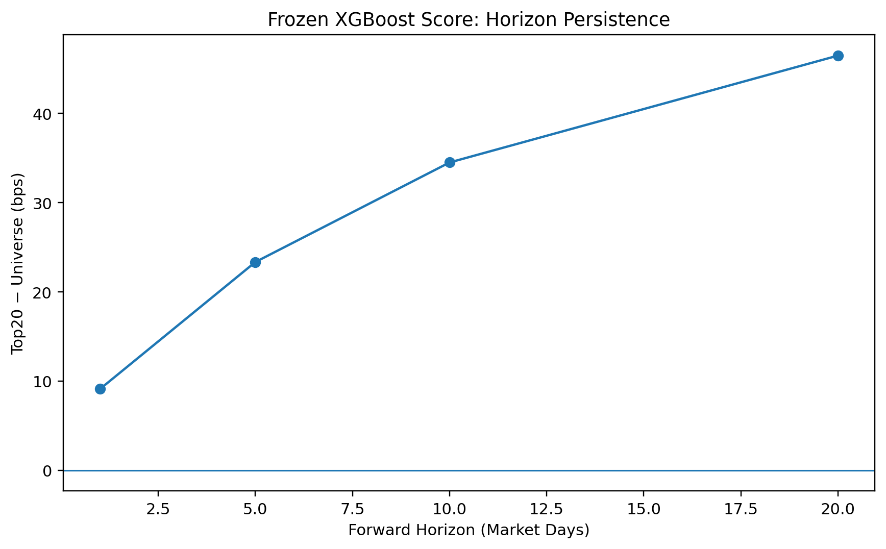
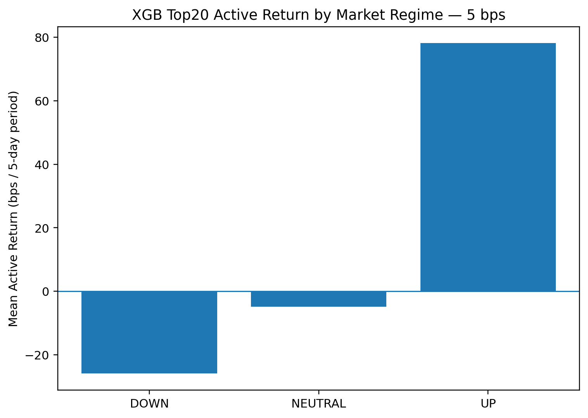

# China A-Share Cross-Sectional Alpha Research

> **Price–volume signals, regularized linear models, nonlinear top-tail selection, and executable out-of-sample backtesting in Chinese A-shares.**

## Research Question

**Can simple price–volume signals predict cross-sectional A-share returns out of sample, and do nonlinear machine-learning models provide incremental economic value over linear baselines after realistic execution frictions and transaction costs?**

This repository implements a full research pipeline:

**data engineering → dynamic universe → signal construction → single-factor tests → OLS/Ridge → XGBoost → executable portfolio backtest → robustness tests**

The research design is frozen after the 2019–2025 OOS sample is opened. No post-OOS factor deletion, sign flipping, XGBoost retuning, or regime-based strategy modification is performed.

## Main Findings

### Price–volume signals contain persistent OOS information

The frozen eleven-signal set spans momentum/reversal, volatility, abnormal trading activity, and intraday range. The strongest standalone 2019–2025 OOS RankIC is Range20:

- Mean RankIC: **-0.0811**
- HAC t-stat: **-8.61**

The dominant pattern is short-horizon reversal plus low-volatility / low-extreme-movement effects.

### Ridge is the strongest broad cross-sectional ranker

| Model | OOS Mean IC | OOS Mean RankIC | Q5–Q1 | Q5–Universe |
|---|---:|---:|---:|---:|
| OLS | 0.0463 | 0.0634 | 60.64 bps | 14.40 bps |
| **Ridge** | 0.0520 | **0.0842** | 57.96 bps | 7.60 bps |
| **XGBoost** | **0.0566** | 0.0610 | **76.17 bps** | **24.94 bps** |

Ridge provides the best **broad ranking**. XGBoost does **not** dominate Ridge on overall RankIC.

### XGBoost adds value mainly through top-tail selection

The nonlinear model is more useful for identifying future outperformers in the top tail than for ranking the entire cross-section.

- **Ridge:** stronger full cross-sectional ordering.
- **XGBoost:** stronger top-quintile economics.

### Executable XGBoost portfolio

Primary specification:

- XGBoost
- Top 20% long-only equal-weight
- lagged-ADV20 Top1500 universe
- rebalance every 5 market days
- execute at next market open
- primary cost assumption: 5 bps one-way

| One-way cost | XGB Top20 CAGR | Sharpe | Universe EW CAGR |
|---:|---:|---:|---:|
| 0 bps | 14.48% | 0.588 | 4.07% |
| **5 bps** | **10.43%** | **0.473** | **3.64%** |
| 10 bps | 6.53% | 0.358 | 3.21% |
| 20 bps | -0.85% | 0.128 | 2.37% |

The strategy survives **moderate**, but not high, transaction costs.

### Liquidity robustness

Under a stricter lagged-ADV20 Top1000 universe:

- XGB Top20 CAGR @ 5 bps: **8.89%**
- Sharpe: **0.428**

### Horizon robustness

| Horizon | Mean RankIC | Top20–Universe | HAC t |
|---:|---:|---:|---:|
| 1 day | 0.0431 | 9.11 bps | 2.96 |
| 5 days | 0.0582 | 23.34 bps | 3.84 |
| 10 days | 0.0662 | 34.51 bps | 3.90 |
| 20 days | 0.0678 | 46.49 bps | 3.55 |

The effect is strongest per day at short horizons and decays gradually.

### Regime dependence

| Regime | Mean active return | HAC t |
|---|---:|---:|
| DOWN | -25.89 bps | -1.82 |
| NEUTRAL | -4.93 bps | -0.79 |
| **UP** | **78.15 bps** | **4.49** |

The strategy is **not defensive**; active returns are concentrated in rising-market periods.

## Research Design

### Sample split

- Raw history: **2009-06-01 to 2025-12-31**
- Formal sample: **2010-01-01 to 2025-12-31**
- Train: **2010–2016**
- Validation: **2017–2018**
- OOS: **2019–2025**

Validation is used for model selection. OOS is not used to retune factors or models.

### Dynamic investable universe

Key filters:

- Shanghai + Shenzhen A-shares only
- seasoning ≥ 120 market trading days
- historical ST/*ST handling
- suspension-aware execution
- baseline close ≥ RMB 5
- lagged ADV20 liquidity screen
- Top1500 primary / Top1000 robustness

### Frozen signals

1. MOM5
2. MOM20
3. MOM60
4. VOL5
5. VOL20
6. VOL60
7. VOL5 / VOL60
8. VolumeRatio20
9. AmountRatio20
10. Range1
11. Range20

Daily preprocessing: 1%–99% cross-sectional winsorization followed by z-scoring.

### Prediction target

Signal after close on day \(t\), execute at next open:

\(
R^{(5)}_{i,t}
=
\frac{P^{adj,open}_{i,t+6}}
     {P^{adj,open}_{i,t+1}}
-1.
\)

## Executable Backtest Rules

The portfolio engine explicitly handles:

- next-open execution,
- no new buy at upper price limit,
- no sell at lower price limit,
- suspension-aware trading,
- no new buy for current ST names,
- T+1,
- self-financing cash / shares / NAV accounting,
- 0 / 5 / 10 / 20 bps one-way cost scenarios.

A critical look-ahead safeguard is that the trading universe uses **signal-date information only**. Future target availability is never used to decide tradability.

## Selected Figures











## Repository Structure

```text
china-a-share-alpha/
├─ README.md
├─ README_CN.md
├─ requirements.txt
├─ .gitignore
├─ REPRODUCIBILITY.md
├─ PROJECT_STRUCTURE.md
├─ src/
├─ docs/
│  ├─ reports/
│  └─ figures/
├─ results/
│  └─ final_tables/
└─ data/
   └─ README.md
```

Raw market data and large intermediate parquet files are intentionally excluded.

## Key Limitations

- High turnover makes performance transaction-cost sensitive.
- The strategy does not survive the **20 bps one-way** cost stress test.
- Maximum drawdown is approximately **-48.5%** in the primary specification.
- The strategy is long-only and retains substantial market exposure.
- XGBoost has lower broad OOS RankIC than Ridge.
- Executable XGBoost-minus-Ridge return differences are economically positive but not strongly statistically significant.
- Active returns are concentrated in **UP** regimes.
- Feature importance is descriptive, not causal.

## Final Takeaway

> **Simple price–volume characteristics contain persistent OOS cross-sectional information in Chinese A-shares. Ridge provides the strongest broad ranking under feature collinearity, while XGBoost adds economic value primarily through nonlinear top-tail selection. That edge survives realistic execution and moderate transaction costs, but comes with high turnover, substantial drawdowns, and regime dependence.**

## Disclaimer

Research and educational project only. Not investment advice and not a live trading track record.
